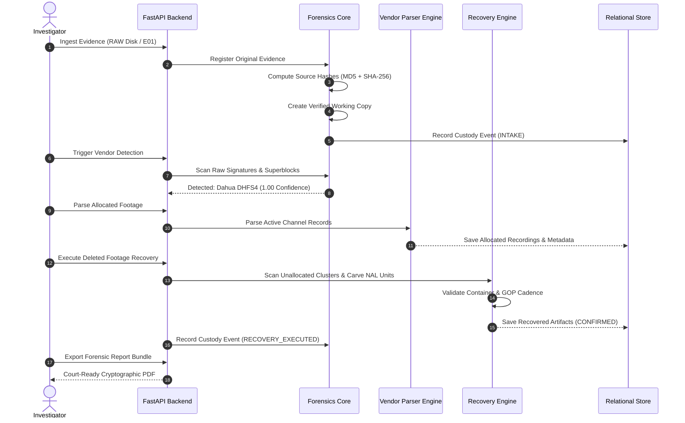

# System Architecture Specification
## SIH 2026 – Problem Statement 26150
### Multi-Vendor DVR/NVR Forensic Analysis Tool

---

## 1. Architectural Philosophy & Design Principles

The SIH-26150 DVR/NVR Forensics Platform is architected around the core tenets of digital forensics: **admissibility**, **reproducibility**, **transparency**, and **extensibility**.

Unlike generic video management software or media players, this platform does not treat surveillance evidence as arbitrary media files. Instead, it models evidence as a structured forensic entity with an unbroken physical-to-logical provenance trail.

### Key Tenets:
1. **Zero Evidence Contamination**: The original disk image is strictly isolated in a read-only state.
2. **Deterministic Processing**: All hashing and carving algorithms yield bit-for-bit identical outputs given the same input stream.
3. **Plug-and-Play Vendor Abstraction**: Proprietary filesystem logic is encapsulated within decoupled parser plugins (`BaseDVRParser`).
4. **Explainable Carving**: Deleted footage recovery is accompanied by structural confidence validation.
5. **Strict AI Segregation**: AI insights exist in an isolated layer and never modify or corrupt primary evidence.

---

## 2. High-Level System Architecture

```mermaid
graph TB
    subgraph Client Layer ["Frontend (React + TypeScript + Plain CSS)"]
        UI_Dash["Dashboard & Intake"]
        UI_Player["Forensic Replay Player"]
        UI_Timeline["Cross-Camera Timeline"]
        UI_Lineage["Evidence Lineage DAG"]
        UI_Matrix["OEM Coverage Matrix"]
    end

    subgraph Gateway Layer ["API Gateway & Core Platform (FastAPI)"]
        API_Router["REST Router (/api/v1)"]
        API_Auth["Forensic Session / Operator Audit"]
        API_Schemas["Pydantic Contracts & Validation"]
    end

    subgraph Forensics Core ["Forensics Core Engine (Python)"]
        Acq_Mgr["Acquisition & Working Copy Manager"]
        Hasher["Deterministic Dual Hasher (MD5 + SHA-256)"]
        Custody_Mgr["Append-Only Hash-Chained Custody Ledger"]
        Vendor_Det["Multi-Signal OEM Detector"]
    end

    subgraph Parser & Recovery Layer ["Parser & Recovery Engine"]
        Parser_Reg["Parser Plugin Registry"]
        DHFS_Parser["Dahua / CP Plus (DHFS4) Adapter"]
        HIK_Parser["Hikvision Container Adapter"]
        Generic_Parser["Generic RAW / Carving Adapter"]
        Carver["H.264/H.265 NAL Carving Engine"]
        Confidence_Eng["Recovery Confidence & Validator"]
        Timestamp_Norm["Timestamp Normalizer & Drift Engine"]
    end

    subgraph Analytical & Output Layer ["Analytical & Reporting Layer"]
        AI_Motion["OpenCV Motion Subtraction (Isolated)"]
        Lineage_Gen["Lineage Graph Generator"]
        Report_Gen["Cryptographic PDF Report Engine"]
    end

    subgraph Storage Layer ["Storage & Persistence"]
        DB[(SQLite / PostgreSQL Relational DB)]
        Disk_Original["Original Evidence (Read-Only)"]
        Disk_Working["Working Copies & Forensic Images"]
        Disk_Artifacts["Recovered Clips & Export Packages"]
    end

    Client Layer -->|REST / JSON| Gateway Layer
    Gateway Layer --> Forensics Core
    Gateway Layer --> Parser & Recovery Layer
    Gateway Layer --> Analytical & Output Layer
    Gateway Layer --> Storage Layer
    Forensics Core --> Storage Layer
    Parser & Recovery Layer --> Storage Layer
```

---

## 3. Subsystem Breakdown

### 3.1 Forensics Core (Member 1 Ownership)
* **Acquisition Manager**: Mounts original storage or raw disk images with strict write-inhibition flags. Generates identical bit-stream working copies in `03_working_copy/`.
* **Dual Hasher (`DualHasher`)**: Computes streaming MD5 and SHA-256 simultaneously across chunked byte buffers ($64\text{ KB}$ default). Provides deterministic verification functions.
* **Chain of Custody Ledger (`ChainOfCustodyManager`)**: Implements a cryptographically chained append-only ledger where every event contains:
  $$\text{EventHash}_i = \text{SHA256}(\text{CaseID} \parallel \text{EvidenceID} \parallel \text{Action} \parallel \text{Actor} \parallel \text{Timestamp} \parallel \text{PrevHash}_{i-1})$$
* **Vendor Detector (`VendorDetector`)**: Analyzes raw binary signatures:
  - Magic byte sequences (e.g., `DHFS`, `HIKVISION`, `HIKB`).
  - Filesystem superblocks and sector layouts.
  - Index block structures and export folder naming patterns.
  - Emits normalized confidence score $[0.0, 1.0]$ and diagnostic explanation array.

### 3.2 Parser & Recovery Engine (Member 2 Ownership)
* **Parser Registry (`ParserRegistry`)**: Dynamic discovery and loading of vendor adapters conforming to the `BaseDVRParser` contract.
* **DHFS4 / Dahua Adapter**: Traverses Dahua proprietary disk structures:
  - Parses Master Sector and Allocation Bitmaps.
  - Reads active channel recording tables.
  - Resolves sector offsets to media frames.
* **Deleted Recovery Engine (`VideoCarver`)**:
  - Scans unallocated disk regions for H.264 NAL prefixes (`0x00000001` / `0x000001`).
  - Identifies Sequence Parameter Sets (SPS - NAL type 7) and Picture Parameter Sets (PPS - NAL type 8).
  - Groups NAL units into complete Groups of Pictures (GOPs).
  - Validates container and packet integrity.
* **Recovery Confidence Engine**:
  - Scores recovered clips into `CONFIRMED`, `PROBABLE`, `PARTIAL`, or `FAILED`.
  - Generates verifiable explanation checklists for forensic audits.
* **Timestamp Normalization Engine**:
  - Ingests raw hardware clock integers.
  - Applies user-defined or metadata-derived timezone offsets ($\Delta T_{\text{tz}}$) and clock drift corrections ($\Delta T_{\text{drift}}$):
    $$T_{\text{normalized}} = T_{\text{raw}} - \Delta T_{\text{tz}} \pm \Delta T_{\text{drift}}$$
  - Stores both $T_{\text{raw}}$ and $T_{\text{normalized}}$ side-by-side.

### 3.3 Platform, UI & Reporting (Member 3 Ownership)
* **FastAPI Backend Application**:
  - Exposes clean, OpenAPI-compliant endpoints (`/api/v1/cases`, `/api/v1/evidence`, `/api/v1/recovery`, etc.).
  - Manages database sessions via SQLAlchemy 2.0.
* **Relational Database**:
  - Models cases, evidence, recordings, recovered artifacts, chain of custody logs, lineage nodes, and AI findings.
* **React Web Frontend**:
  - Clean, dark-themed interface built using pure CSS / CSS modules.
  - Includes Forensic Replay dual-pane viewer and interactive Lineage DAG.
* **Standardized PDF Report Engine**:
  - Produces court-ready investigative documentation containing case summaries, equipment parameters, dual hash tables, recovery confidence breakdowns, cross-camera timelines, and unbroken custody ledgers.

---

## 4. Data Flow Pipeline



---

## 5. Storage Directory Topology
All runtime forensic assets conform to the standardized directory topology:

```
evidence_cases/
└── CASE-001/
    ├── 00_case_metadata/       # Case parameters, investigator info, JSON specs
    ├── 01_original_evidence/   # RAW / DD disk image (Strictly Read-Only)
    ├── 02_forensic_image/      # Bit-stream verified duplicate
    ├── 03_working_copy/        # Active working copy for carving and analysis
    ├── 04_parsed_metadata/     # Extracted stream index JSON & XML dumps
    ├── 05_recovered_media/     # Carved and reconstructed video clips (.mp4, .h264)
    ├── 06_exports/             # Investigator evidence exports
    ├── 07_hashes/              # Hash verification manifests and audit logs
    ├── 08_timeline/            # Normalized cross-camera timeline models
    ├── 09_ai_findings/         # Isolated motion & detection bounding boxes
    ├── 10_report/              # Generated PDF forensic reports
    └── 11_chain_of_custody/    # Cryptographically signed custody ledger
```
