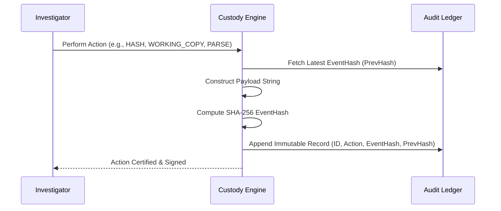

# Cryptographic Chain of Custody Specification
## SIH 2026 – Problem Statement 26150
### Multi-Vendor DVR/NVR Forensic Analysis Tool

---

## 1. Provenance Architecture
In criminal proceedings, evidence is only admissible if an unbroken, tamper-evident Chain of Custody demonstrates that the digital evidence remained genuine and untampered from the moment of physical seizure to final presentation.

Our platform implements an **append-only, cryptographically linked blockchain-style audit ledger**.

---

## 2. Cryptographic Hash-Chaining Formula

Every custody event $E_i$ is bound to all preceding events via SHA-256 cryptographic linkage:

$$\text{EventData}_i = \text{CaseID} \parallel \text{EvidenceID} \parallel \text{Action} \parallel \text{Actor} \parallel \text{Timestamp} \parallel \text{SrcHash} \parallel \text{DstHash} \parallel \text{ToolVersion} \parallel \text{PrevHash}_{i-1}$$

$$\text{EventHash}_i = \text{SHA256}(\text{EventData}_i)$$

### Genesis Event ($E_0$)
The initial intake event links to a standardized genesis hash:
$$\text{PrevHash}_0 = \text{"0000000000000000000000000000000000000000000000000000000000000000"}$$

---

## 3. Custody Event Lifecycle



### Supported Forensic Action Types
1. `EVIDENCE_ACQUIRED`: Initial registration of seized media.
2. `HASH_CALCULATED`: Baseline MD5 and SHA-256 generation.
3. `FORENSIC_IMAGE_CREATED`: Bit-stream verified image duplication.
4. `WORKING_COPY_CREATED`: Analytical working copy isolation.
5. `VENDOR_DETECTED`: Automated OEM classification.
6. `PARSER_EXECUTED`: Extraction of active recordings.
7. `RECOVERY_EXECUTED`: Carving of unallocated clusters.
8. `TIMELINE_GENERATED`: Multi-camera normalization.
9. `AI_ANALYSIS_EXECUTED`: Auxiliary motion/object inference.
10. `REPORT_GENERATED`: Standardized court bundle compilation.
11. `CASE_SEALED`: Final immutable closure of case.

---

## 4. Verification Algorithm: `verify_chain()`

The platform provides an automated mathematical verification function:

```python
def verify_chain(events: List[CustodyEvent]) -> Tuple[bool, str]:
    if not events:
        return True, "Chain is empty (Valid)"
    
    # 1. Verify Genesis
    if events[0].previous_event_hash != "0" * 64:
        return False, f"Genesis link invalid at Event {events[0].id}"
        
    # 2. Sequential Verification
    for i in range(len(events)):
        current = events[i]
        
        # Verify internal cryptographic signature
        calculated_hash = calculate_event_hash(current)
        if calculated_hash != current.event_hash:
            return False, f"Hash tampering detected at Event {current.id}"
            
        # Verify backward link to predecessor
        if i > 0:
            previous = events[i - 1]
            if current.previous_event_hash != previous.event_hash:
                return False, f"Broken link between Event {previous.id} and {current.id}"
                
    return True, "CHAIN VALID: All cryptographic links verified"
```

In the UI, this displays as a live status badge:
* `CHAIN VALID ✓` (Green)
* `CHAIN INVALID ✗` (Red alert with exact event ID flagged for tampering)
