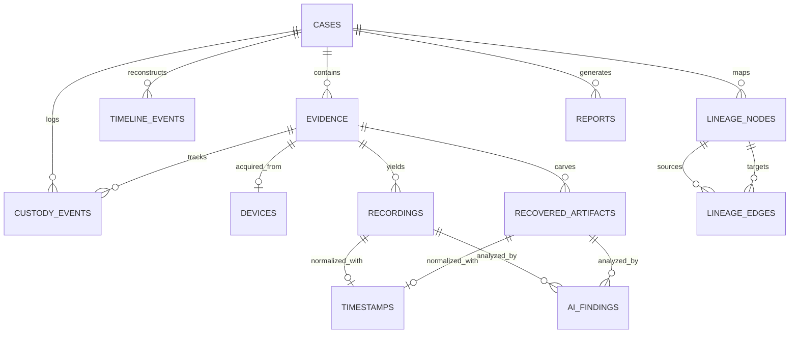

# Relational Database Schema Specification
## SIH 2026 – Problem Statement 26150
### Multi-Vendor DVR/NVR Forensic Analysis Tool

---

## 1. Overview & Architecture
The platform utilizes SQLAlchemy 2.0 ORM with native support for **SQLite** (for portable offline triage and zero-configuration development) and **PostgreSQL** (for enterprise multi-user deployment).

---

## 2. Entity Relationship Diagram

---

## 3. Core Tables & Column Definitions

### 3.1 `cases`
* `id` (String, PK): e.g., `CASE-001`.
* `name` (String, Not Null): Case title.
* `investigator` (String, Not Null): Lead investigator ID/name.
* `agency` (String): Law enforcement or corporate unit.
* `description` (Text): Incident background.
* `status` (Enum: `OPEN`, `IN_PROGRESS`, `SEALED`, `CLOSED`): Case status.
* `created_at` (DateTime): Intake UTC timestamp.
* `updated_at` (DateTime): Last modification UTC timestamp.

### 3.2 `evidence`
* `id` (String, PK): e.g., `EV-001`.
* `case_id` (String, FK -> `cases.id`, Not Null).
* `label` (String): Human-readable evidence tag.
* `original_file_path` (String, Not Null): Path to write-protected image.
* `working_copy_path` (String): Path to verified working copy.
* `file_size_bytes` (BigInteger, Not Null).
* `source_md5` (String, 32 chars, Not Null).
* `source_sha256` (String, 64 chars, Not Null).
* `working_sha256` (String, 64 chars): Verified duplicate hash.
* `detected_vendor` (String): e.g., `Dahua`, `Hikvision`, `UNKNOWN`.
* `vendor_profile` (String): e.g., `DHFS4`.
* `vendor_confidence` (Float): $0.0$ to $1.0$.
* `is_verified` (Boolean, Default: False).
* `created_at` (DateTime).

### 3.3 `recordings`
* `id` (String, PK): e.g., `REC-001`.
* `evidence_id` (String, FK -> `evidence.id`, Not Null).
* `artifact_id` (String, Unique, Not Null): Universal Fingerprint.
* `channel_id` (String, Not Null): e.g., `CAM-01`.
* `camera_name` (String): e.g., `Main Entrance Gate`.
* `start_time_raw` (String, Not Null): Raw device clock string.
* `end_time_raw` (String, Not Null).
* `start_time_utc` (DateTime, Not Null): Normalized UTC start.
* `end_time_utc` (DateTime, Not Null): Normalized UTC end.
* `duration_seconds` (Float, Not Null).
* `source_sector_offset` (BigInteger, Not Null): Sector offset on raw disk.
* `source_byte_length` (BigInteger, Not Null).
* `file_path` (String, Not Null): Path to extracted clip.
* `codec` (String): e.g., `H.264`, `H.265`.
* `resolution` (String): e.g., `1920x1080`.
* `fps` (Float).
* `sha256` (String, 64 chars, Not Null).
* `md5` (String, 32 chars, Not Null).

### 3.4 `recovered_artifacts`
* `id` (String, PK): e.g., `REC-DEL-001`.
* `evidence_id` (String, FK -> `evidence.id`, Not Null).
* `artifact_id` (String, Unique, Not Null): e.g., `ART-DEL-CAM03-20260911`.
* `channel_id` (String): Inferred or carved channel ID.
* `recovery_status` (Enum: `CONFIRMED`, `PROBABLE`, `PARTIAL`, `FAILED`).
* `confidence_score` (Float): $0.0$ to $1.0$.
* `recovery_method` (String): e.g., `NAL_CARVING_H264`.
* `source_byte_offset` (BigInteger, Not Null).
* `source_byte_length` (BigInteger, Not Null).
* `start_time_utc` (DateTime).
* `duration_seconds` (Float).
* `explanation_rules` (JSON): Diagnostic verification checklist.
* `file_path` (String, Not Null).
* `sha256` (String, 64 chars, Not Null).
* `md5` (String, 32 chars, Not Null).

### 3.5 `custody_events`
* `id` (String, PK): e.g., `CUST-001`.
* `case_id` (String, FK -> `cases.id`, Not Null).
* `evidence_id` (String, FK -> `evidence.id`): Associated evidence if applicable.
* `sequence_index` (Integer, Not Null): Incremental sequence counter.
* `action` (String, Not Null): e.g., `EVIDENCE_ACQUIRED`, `WORKING_COPY_CREATED`.
* `actor` (String, Not Null): Investigator name / ID.
* `timestamp` (DateTime, Not Null): Event UTC timestamp.
* `source_hash` (String, 64 chars): Hash before action.
* `destination_hash` (String, 64 chars): Hash after action.
* `tool_version` (String, Not Null): Platform version string.
* `previous_event_hash` (String, 64 chars, Not Null): Previous event cryptographic link.
* `event_hash` (String, 64 chars, Unique, Not Null): Current event cryptographic digest.
* `notes` (Text).

### 3.6 `lineage_nodes` & `lineage_edges`
* **Nodes**: `id`, `case_id`, `node_type` (`ORIGINAL_EVIDENCE`, `FORENSIC_IMAGE`, `PARSED_RECORDING`, `RECOVERED_CLIP`, `WORKING_COPY`, `AI_FINDING`, `EXPORT`), `label`, `sha256`, `timestamp`, `metadata_json`.
* **Edges**: `id`, `case_id`, `source_node_id`, `target_node_id`, `transformation_type` (`HASH_VERIFY`, `PARSE`, `CARVE`, `NORMALIZE`, `ANALYZE`, `EXPORT`).

### 3.7 `ai_findings`
* `id` (String, PK).
* `artifact_id` (String, Not Null): Reference to recording or recovered clip.
* `model_name` (String, Not Null): e.g., `OpenCV BackgroundSubtractorMOG2`.
* `finding_type` (String): `MOTION_DETECTED`, `PERSON_DETECTED`.
* `frame_timestamp` (DateTime).
* `confidence` (Float).
* `bounding_box` (JSON): `[x, y, width, height]`.
* `is_primary_evidence` (Boolean, Default: False): Strict isolation indicator.
