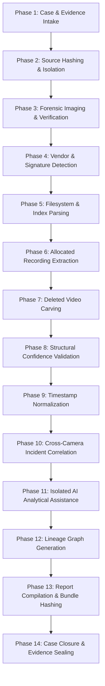

# Standard Operating Procedure (SOP) & Forensic Workflow
## SIH 2026 – Problem Statement 26150
### Multi-Vendor DVR/NVR Forensic Analysis Tool

---

## 1. Compliance & Legal Standard Alignment
This Standard Operating Procedure (SOP) complies with international standards for digital evidence handling (**ISO/IEC 27037:2012** – *Guidelines for identification, collection, acquisition, and preservation of digital evidence*) and standard forensic science admissibility criteria (e.g., Federal Rules of Evidence 901/702, Indian Evidence Act Section 65B / Bharatiya Sakshya Adhiniyam Section 63).

---

## 2. Core Forensic Mandates

> [!IMPORTANT]
> 1. **Original Evidence Inviolability**: The original physical media or seized bit-stream disk image must never be mounted in write mode or altered in any manner.
> 2. **Deterministic Dual Hashing**: Every digital artifact ingested or extracted must be hashed concurrently with **MD5** and **SHA-256**.
> 3. **Cryptographic Provenance**: Every analytical step, conversion, or carving action must be appended to the cryptographically linked Chain of Custody ledger.
> 4. **Dual Timestamp Preservation**: Hardware DVR timestamps must never be overwritten or discarded. Normalized UTC timestamps must be stored alongside raw values.
> 5. **Explainable Findings**: Recovery and AI results must provide transparent technical justifications rather than opaque probability scores.

---

## 3. End-to-End Forensic Workflow SOP

### Phase 1: Case & Evidence Intake
* **Step 1**: Initialize case record with mandatory fields: `case_id` (e.g., `CASE-001`), `case_name`, `investigator_name`, `organization`, and `incident_date`.
* **Step 2**: Create standardized folder hierarchy in the dedicated evidence repository (`00_case_metadata` through `11_chain_of_custody`).
* **Step 3**: Document seized hardware parameters: OEM label, model number, serial number, storage capacity, physical interface, and acquisition notes.

### Phase 2: Source Hashing & Evidence Isolation
* **Step 4**: Place original bit-stream image (RAW / DD / E01) into `01_original_evidence/`.
* **Step 5**: Apply read-only file system permissions (`chmod 0400` / Windows read-only attribute).
* **Step 6**: Compute baseline deterministic dual hashes:
  - $\text{Hash}_{\text{MD5}}$
  - $\text{Hash}_{\text{SHA256}}$
* **Step 7**: Commit initial `EVIDENCE_ACQUIRED` event to the cryptographic Chain of Custody ledger.

### Phase 3: Forensic Imaging & Working Copy Creation
* **Step 8**: Create bit-stream verified forensic duplicate into `02_forensic_image/`.
* **Step 9**: Re-hash duplicate to verify 100% cryptographic parity:
  $$\text{SHA256}(\text{ForensicImage}) \stackrel{?}{=} \text{SHA256}(\text{OriginalEvidence})$$
* **Step 10**: Generate active working copy in `03_working_copy/` for analytical processing.
* **Step 11**: Log `WORKING_COPY_CREATED` event.

### Phase 4: Multi-Signal Vendor Detection
* **Step 12**: Execute automated `VendorDetector` against the working copy.
* **Step 13**: Scan for:
  - Magic byte sequences (e.g., `DHFS`, `HIKVISION`, `HIKB`).
  - Partition tables and superblock sector geometry.
  - Proprietary index block markers.
* **Step 14**: If confident ($\ge 0.85$), load the corresponding validated parser profile. If ambiguous, set `vendor = "UNKNOWN"` and invoke generic carving.

### Phase 5 & 6: Filesystem Parsing & Active Stream Extraction
* **Step 15**: Parse filesystem allocation bitmaps and active channel directory blocks.
* **Step 16**: Extract allocated video streams into `04_parsed_metadata/`.
* **Step 17**: Extract stream metadata: channel number, recording start/end, container format, video codec, resolution, and source sector byte offsets.
* **Step 18**: Assign Universal Forensic Evidence Fingerprint to each extracted clip.

### Phase 7 & 8: Deleted Video Carving & Confidence Scoring
* **Step 19**: Identify unallocated sector clusters and deleted index markers.
* **Step 20**: Scan unallocated space for H.264/H.265 NAL byte prefixes (`0x0000000167` for SPS, `0x0000000168` for PPS, `0x0000000165` for IDR slices).
* **Step 21**: Reconstruct candidate video streams from contiguous and fragmented GOPs.
* **Step 22**: Run structural validation engine:
  - Validate container header.
  - Validate frame cadence and monotonic PTS/DTS.
  - Validate stream playable duration.
* **Step 23**: Classify recovery status:
  - `CONFIRMED`: All checks passed.
  - `PROBABLE`: GOP valid, non-critical metadata truncated.
  - `PARTIAL`: Carved frame sequence with missing headers.
  - `FAILED`: Unplayable corrupt payload.
* **Step 24**: Hash carved artifact and save in `05_recovered_media/`.

### Phase 9: Timestamp Normalization
* **Step 25**: Extract raw hardware device clock integer ($T_{\text{raw}}$).
* **Step 26**: Record investigator-supplied or metadata-derived timezone offset ($\Delta T_{\text{tz}}$) and clock drift ($\Delta T_{\text{drift}}$).
* **Step 27**: Calculate standardized UTC timestamp:
  $$T_{\text{UTC}} = T_{\text{raw}} - \Delta T_{\text{tz}} \pm \Delta T_{\text{drift}}$$
* **Step 28**: Preserve both $T_{\text{raw}}$ and $T_{\text{UTC}}$ in database records.

### Phase 10: Cross-Camera Incident Timeline Reconstruction
* **Step 29**: Aggregate all extracted and carved clips across all camera channels.
* **Step 30**: Order events chronologically using normalized UTC timestamps.
* **Step 31**: Generate incident movement sequence linking each event to its source clip and evidence ID.

### Phase 11: Isolated AI Analytical Assistance
* **Step 32**: Execute background subtraction and motion detection on working copies.
* **Step 33**: Store bounding boxes, motion heatmaps, and timestamps in `09_ai_findings/`.
* **Step 34**: Clearly flag every AI output with `[AI FINDING - NON-PRIMARY EVIDENCE]`.

### Phase 12: Evidence Lineage Graph Generation
* **Step 35**: Construct directed acyclic graph (DAG) tracing each clip from:
  $$\text{Sector Offset} \longrightarrow \text{Carved Clip} \longrightarrow \text{Working Copy} \longrightarrow \text{AI Finding} \longrightarrow \text{Report}$$
* **Step 36**: Verify all intermediate hashes link to parent nodes.

### Phase 13 & 14: Report Generation & Evidence Sealing
* **Step 37**: Compile standardized forensic report (PDF) including case metadata, dual hash manifests, recovery checklists, cross-camera timeline, and chain of custody log.
* **Step 38**: Compute SHA-256 of final generated report and export bundle in `06_exports/`.
* **Step 39**: Verify end-to-end Chain of Custody ledger via `verify_chain()`.
* **Step 40**: Change case status to `CLOSED` and seal evidence package.
