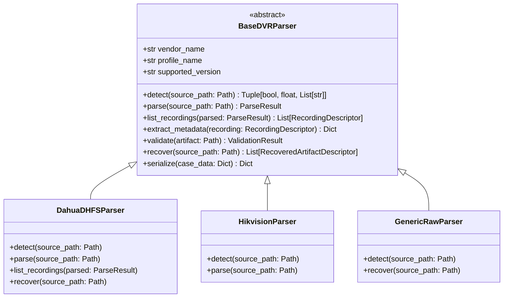

# Parser Plugin Specification & Contract
## SIH 2026 – Problem Statement 26150
### Multi-Vendor DVR/NVR Forensic Analysis Tool

---

## 1. Modular Adapter Architecture
To avoid rigid monoliths and support dozens of proprietary DVR formats, the platform employs a **Vendor-Neutral Plugin Interface**. All vendor-specific parsing, index decoding, and proprietary sector traversal logic is encapsulated within plugins derived from `BaseDVRParser`.



---

## 2. Standard Interface Methods

Every parser plugin must implement the following lifecycle methods:

### 2.1 `detect(source_path: Path) -> Tuple[bool, float, List[str]]`
* **Purpose**: Inspects disk header, magic bytes, partition geometry, and superblock signatures.
* **Return**: `(is_match: bool, confidence_score: float [0.0 - 1.0], reasons: List[str])`.
* **Constraint**: Must never evaluate file extension or path name; must inspect raw byte streams.

### 2.2 `parse(source_path: Path) -> ParseResult`
* **Purpose**: Traverses active filesystem tables, master sectors, and channel indices.
* **Return**: `ParseResult` object containing partition layout, channel count, and index entries.

### 2.3 `list_recordings(parsed: ParseResult) -> List[RecordingDescriptor]`
* **Purpose**: Extracts allocated recording descriptors.
* **Return**: List of recordings containing channel ID, start/end timestamps, duration, sector offsets, and byte lengths.

### 2.4 `extract_metadata(recording: RecordingDescriptor) -> Dict[str, Any]`
* **Purpose**: Extracts container parameters, SPS/PPS NAL unit headers, video resolution, frame rate, and compression profile.

### 2.5 `recover(source_path: Path) -> List[RecoveredArtifactDescriptor]`
* **Purpose**: Carves unallocated clusters and recovers deleted video streams.

### 2.6 `validate(artifact: Path) -> ValidationResult`
* **Purpose**: Executes structural container and stream integrity checks.

---

## 3. Adding a New OEM Plugin
1. Create a new module in `backend/app/parsers/profiles/<oem_name>.py`.
2. Subclass `BaseDVRParser`.
3. Implement `detect`, `parse`, `list_recordings`, and `recover`.
4. Register the class in `ParserRegistry`:
   ```python
   from app.parsers.registry import parser_registry
   from app.parsers.profiles.my_oem import MyOEMParser

   parser_registry.register(MyOEMParser())
   ```
5. Add unit test fixtures in `tests/unit/test_parsers.py` with ground truth test samples.
