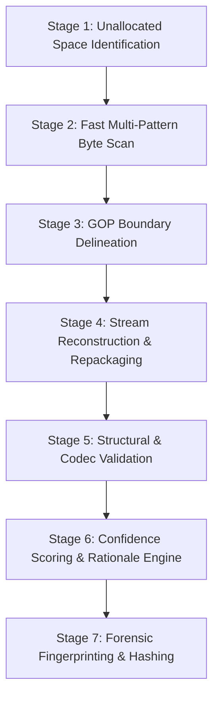

# Deleted Video Recovery & Carving Specification
## SIH 2026 – Problem Statement 26150
### Multi-Vendor DVR/NVR Forensic Analysis Tool

---

## 1. Forensic Recovery Philosophy
In surveillance DVR forensics, deleted video files are rarely completely wiped immediately. Instead:
1. The filesystem index entry or block allocation pointer is cleared or decremented in the master directory sector.
2. The actual H.264/H.265 video elementary stream clusters remain intact in unallocated disk space until overwritten by continuous FIFO recording.

Our recovery engine combines **filesystem-aware index carving** with **raw stream byte-level carving**.

---

## 2. H.264 / H.265 Byte Signature Standards

The carving engine scans raw byte streams using standard NAL (Network Abstraction Layer) prefix markers:

| Marker / NAL Unit Type | Byte Signature (Hex) | Purpose | Criticality |
|---|---|---|---|
| **NAL Unit Prefix (4-byte)** | `00 00 00 01` | Universal NAL start code | Mandatory |
| **NAL Unit Prefix (3-byte)** | `00 00 01` | Alternate NAL start code | Mandatory |
| **H.264 SPS (Seq Param Set)**| `00 00 00 01 67` | Resolution, profile, level, aspect ratio | Essential for stream playback |
| **H.264 PPS (Pic Param Set)**| `00 00 00 01 68` | Entropy coding, slice groups | Essential for decoding |
| **H.264 IDR Slice (Keyframe)**| `00 00 00 01 65` | Instantaneous Decoder Refresh (I-frame) | GOP Anchor |
| **H.264 Non-IDR Slice** | `00 00 00 01 61` / `41` | P-frames and B-frames | Motion frames |
| **H.265 SPS** | `00 00 00 01 42 01` | HEVC sequence header | Essential for HEVC |
| **DHFS Deleted Index Marker** | `DHFS_DEL` / `0xFFFFFFFF` | Filesystem tombstone marker | Filesystem recovery |

---

## 3. Seven-Stage Carving & Assembly Pipeline

1. **Stage 1**: Read partition allocation bitmaps to isolate unallocated or deleted cluster ranges.
2. **Stage 2**: Perform streaming scan using sliding byte windows looking for SPS (`0x67`) headers.
3. **Stage 3**: Group subsequent PPS and IDR keyframes into continuous Groups of Pictures (GOPs).
4. **Stage 4**: Re-encapsulate candidate byte sequences into standard playable containers (MP4 / Raw H.264 ES).
5. **Stage 5**: Execute integrity checks (resolution match, monotonic timestamps, container header validation).
6. **Stage 6**: Calculate confidence score and construct explanation checklist.
7. **Stage 7**: Compute deterministic MD5 + SHA-256 and store physical disk byte offset range `[start_offset, end_offset]`.

---

## 4. Recovery Confidence & Diagnostic Checklist

The system eliminates guesswork by awarding one of four strict forensic grades:

### 4.1 `CONFIRMED` (Confidence: $0.90 - 1.00$)
* Passed: Valid container header.
* Passed: Sequence Parameter Set (SPS) and Picture Parameter Set (PPS) present.
* Passed: At least one full valid Group of Pictures (GOP) with keyframe.
* Passed: Monotonic timestamp progression with zero uncorrectable packet drops.
* Passed: Exact physical disk sector offsets verified.

### 4.2 `PROBABLE` (Confidence: $0.70 - 0.89$)
* Passed: Valid video stream with playable keyframes.
* Warning: Non-critical container metadata missing; reconstructed using generic MP4 muxer.
* Warning: Minor frame drop detected at segment boundary.

### 4.3 `PARTIAL` (Confidence: $0.40 - 0.69$)
* Warning: Fragmented or truncated video segment (e.g. keyframe present, trailing P-frames overwritten).
* Playback: Partial playback possible up to point of sector corruption.
* Rationale explicitly lists: *"Trailing 42 clusters overwritten by subsequent recording loop"*.

### 4.4 `FAILED` (Confidence: $< 0.40$)
* Inconclusive byte sequences; corrupted headers; payload unplayable.
* Safely discarded with diagnostic reason recorded.
